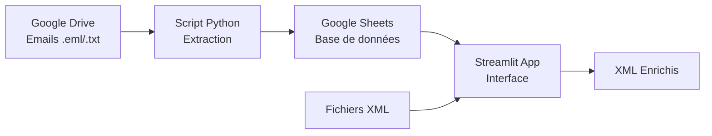

younes semlali <younessemlali@gmail.com>
12:56 (il y a 0 minute)
À moi

# 🤖 PIXID Automation Platform

[](https://www.python.org/downloads/)
[](https://streamlit.io)
[](https://opensource.org/licenses/MIT)
[](tests/)
[](.github/workflows/sync.yml)

Plateforme d'automatisation RH pour PIXID permettant la synchronisation automatique des confirmations de commande (emails) vers Google Sheets et l'enrichissement de fichiers XML.

## 🎯 Fonctionnalités principales

- ✅ **Synchronisation automatique** : Extraction des données d'emails (.eml/.txt) toutes les 15 minutes via GitHub Actions
- ✅ **Enrichissement XML** : Interface Streamlit pour enrichir les fichiers XML avec les données extraites
- ✅ **Dashboard de monitoring** : Visualisation en temps réel des métriques et statistiques
- ✅ **Recherche avancée** : Recherche multi-critères dans les données synchronisées
- ✅ **Health Check** : Surveillance automatique de la santé du système avec recommandations
- ✅ **Sécurité** : Authentification via Google Service Account, aucun mot de passe stocké

## 📋 Table des matières

- [Prérequis](#-prérequis)
- [Installation](#-installation)
- [Configuration](#-configuration)
- [Utilisation](#-utilisation)
- [Architecture](#-architecture)
- [Développement](#-développement)
- [Tests](#-tests)
- [Déploiement](#-déploiement)
- [Troubleshooting](#-troubleshooting)
- [Contribution](#-contribution)

## 📦 Prérequis

- Python 3.11 ou supérieur
- Compte Google Cloud avec Service Account activé
- Accès en écriture au Google Sheet cible
- Accès en lecture au dossier Google Drive source
- Compte GitHub (pour l'automatisation)
- Compte Streamlit Cloud (optionnel, pour l'hébergement)

## 🚀 Installation

### 1. Cloner le repository

```bash
git clone https://github.com/your-username/pixid-automation.git
cd pixid-automation
```

### 2. Créer un environnement virtuel

```bash
python -m venv venv

# Linux/Mac
source venv/bin/activate

# Windows
venv\Scripts\activate
```

### 3. Installer les dépendances

```bash
pip install -r requirements.txt
```

### 4. Créer la structure des dossiers

```bash
# Linux/Mac
chmod +x create_structure.sh
./create_structure.sh

# Windows (créer manuellement ou utiliser)
mkdir logs
mkdir tests\test_fixtures
mkdir .streamlit
```

## ⚙️ Configuration

### 1. Google Service Account

1. Aller sur [Google Cloud Console](https://console.cloud.google.com)
2. Créer un nouveau projet ou sélectionner un projet existant
3. Activer les APIs :
   - Google Drive API
   - Google Sheets API
4. Créer un Service Account :
   - IAM & Admin → Service Accounts → Create Service Account
   - Nom : `pixid-automation`
   - Rôle : Aucun rôle nécessaire au niveau projet
5. Créer une clé JSON :
   - Actions → Manage keys → Add key → Create new key → JSON
   - Télécharger le fichier JSON

### 2. Partage des ressources Google

Partager avec l'email du Service Account (format : `nom@projet.iam.gserviceaccount.com`) :

1. **Google Drive** : 
   - Ouvrir le dossier [1YevTmiEAycLE2X0g01juOO-cWm-O6V2F](https://drive.google.com/drive/folders/1YevTmiEAycLE2X0g01juOO-cWm-O6V2F)
   - Partager avec permission "Lecteur"

2. **Google Sheets** :
   - Ouvrir la feuille [1eVoS4Pd6RiL-4PLaZWC5s8Yzax6VbT5D9Tz5K2deMs4](https://docs.google.com/spreadsheets/d/1eVoS4Pd6RiL-4PLaZWC5s8Yzax6VbT5D9Tz5K2deMs4)
   - Partager avec permission "Éditeur"

### 3. Configuration locale

Créer un fichier `.env` (non versionné) :

```bash
GOOGLE_CREDENTIALS=/path/to/your/credentials.json
# OU directement le JSON
GOOGLE_CREDENTIALS='{"type": "service_account", ...}'
```

### 4. Configuration GitHub Actions

1. Aller dans Settings → Secrets and variables → Actions
2. Créer un nouveau secret : `GOOGLE_CREDENTIALS`
3. Coller le contenu complet du fichier JSON

## 🔧 Utilisation

### Script de synchronisation (local)

```bash
# Exécution simple
python sync_drive_to_sheet.py

# Mode verbose
python sync_drive_to_sheet.py --verbose

# Avec credentials personnalisés
python sync_drive_to_sheet.py --credentials /path/to/creds.json

# Aide
python sync_drive_to_sheet.py --help
```

### Application Streamlit

```bash
# Lancer l'application
streamlit run app.py

# Avec configuration personnalisée
streamlit run app.py --server.port 8080

# L'application sera accessible sur http://localhost:8501
```

### Fonctionnalités de l'application

1. **📊 Dashboard Monitoring**
   - Vue d'ensemble des métriques
   - Graphiques de tendances
   - Analyse des erreurs
   - Health check système

2. **📝 Enrichissement XML**
   - Upload de fichier XML
   - Détection automatique de l'OrderId
   - Enrichissement avec données Google Sheets
   - Téléchargement du XML enrichi

3. **🔍 Recherche de commande**
   - Recherche par numéro, agence ou unité
   - Export des résultats en CSV
   - Statistiques globales

4. **⚙️ Configuration**
   - Test de connexion Google
   - Liens vers les ressources
   - Documentation intégrée

## 🏗️ Architecture

### Structure du projet

```
pixid-automation/
├── src/                      # Modules principaux
│   ├── __init__.py          # Configuration du package
│   ├── email_parser.py      # Extraction des données emails
│   ├── google_client.py     # Clients Google Drive/Sheets
│   ├── xml_processor.py     # Traitement XML
│   └── monitoring.py        # Collecte statistiques
├── tests/                   # Tests unitaires
│   ├── test_email_parser.py
│   ├── test_xml_processor.py
│   └── test_fixtures/       # Fichiers de test
├── .github/workflows/       # GitHub Actions
│   └── sync.yml            # Workflow de synchronisation
├── app.py                  # Application Streamlit
├── sync_drive_to_sheet.py  # Script principal
└── requirements.txt        # Dépendances
```

### Flux de données



### Champs extraits

| Champ | Description | Patterns de recherche |
|-------|-------------|----------------------|
| `numero_commande` | Identifiant unique | "Numéro de commande", "Order ID", etc. |
| `code_agence` | Code de l'agence | "Code agence", "Agency code", etc. |
| `code_unite` | Code de l'unité | "Code unité", "Unit code", etc. |
| `statut` | Statut de la commande | "Statut", "Status", etc. |
| `niveau_convention_collective` | Niveau CC | "Niveau CC", "Convention collective", etc. |
| `classification_interimaire` | Classification du poste | "Classification intérimaire", etc. |
| `personne_absente` | Personne remplacée | "Personne absente", "Remplace", etc. |

## 🧪 Tests

### Exécuter les tests

```bash
# Tous les tests
pytest

# Avec coverage
pytest --cov=src --cov-report=html

# Tests spécifiques
pytest tests/test_email_parser.py -v

# Tests avec markers
pytest -m "not slow"
```

### Structure des tests

- `test_email_parser.py` : Tests d'extraction des emails
- `test_xml_processor.py` : Tests de traitement XML
- `test_fixtures/` : Fichiers d'exemple pour les tests

## 🚀 Déploiement

### GitHub Actions (Automatique)

Le workflow s'exécute automatiquement toutes les 15 minutes. Pour déclencher manuellement :

1. Aller dans Actions → PIXID Drive to Sheets Sync
2. Cliquer sur "Run workflow"
3. Optionnel : activer le mode verbose ou forcer la resynchronisation

### Streamlit Cloud

1. Connecter votre repository GitHub à Streamlit Cloud
2. Configurer les secrets :
   - Aller dans Settings → Secrets
   - Ajouter `GOOGLE_CREDENTIALS` avec le JSON complet
3. Déployer l'application
4. URL personnalisée disponible après déploiement

### Docker (Optionnel)

```dockerfile
FROM python:3.11-slim

WORKDIR /app

COPY requirements.txt .
RUN pip install --no-cache-dir -r requirements.txt

COPY . .

EXPOSE 8501

CMD ["streamlit", "run", "app.py"]
```

## 🔍 Troubleshooting

### Erreurs courantes

1. **"Permission denied" lors de l'accès Google**
   - Vérifier que le Service Account a accès aux ressources
   - Vérifier que l'email du Service Account est correct

2. **"No credentials found"**
   - Vérifier la variable d'environnement `GOOGLE_CREDENTIALS`
   - Vérifier le format du JSON (doit commencer par `{`)

3. **Pas de nouvelles données synchronisées**
   - Vérifier le fichier `sync_state.json`
   - Supprimer le fichier pour forcer une resynchronisation

4. **Streamlit "Connection error"**
   - Vérifier les secrets Streamlit
   - Relancer l'application

### Logs et debugging

```bash
# Consulter les logs locaux
tail -f logs/pixid_automation.log

# Consulter les artifacts GitHub Actions
# Aller dans Actions → Run → Artifacts

# Mode debug complet
export LOG_LEVEL=DEBUG
python sync_drive_to_sheet.py --verbose
```

## 🤝 Contribution

1. Fork le projet
2. Créer une branche (`git checkout -b feature/AmazingFeature`)
3. Commit les changements (`git commit -m 'Add AmazingFeature'`)
4. Push vers la branche (`git push origin feature/AmazingFeature`)
5. Ouvrir une Pull Request

### Standards de code

- Formatter avec `black`
- Linter avec `flake8`
- Type hints quand possible
- Docstrings pour toutes les fonctions publiques
- Tests pour les nouvelles fonctionnalités

## 📄 License

Distribué sous licence MIT. Voir `LICENSE` pour plus d'informations.

## 👥 Contact

Pour toute question ou support :
- Créer une [issue GitHub](https://github.com/your-username/pixid-automation/issues)
- Email : support@pixid.fr

## 🙏 Remerciements

- [Streamlit](https://streamlit.io) pour l'interface web
- [Google APIs](https://developers.google.com) pour l'intégration
- [GitHub Actions](https://github.com/features/actions) pour l'automatisation

---

**Made with ❤️ by PIXID Automation Team**
